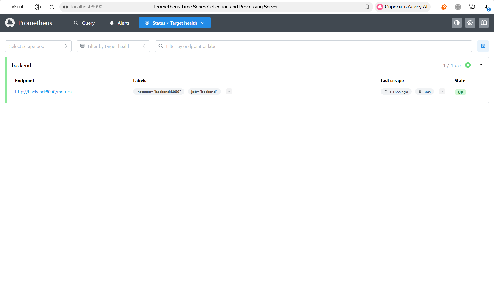
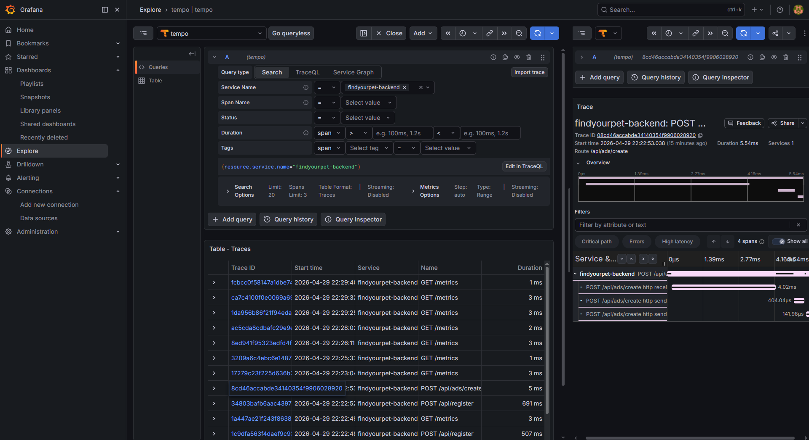
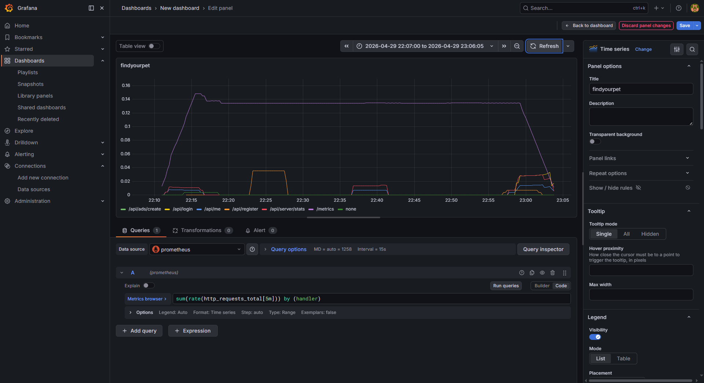

# Отчет о выполнении лабораторной работы №7

## Тема: Системы мониторинга и наблюдаемости (Observability)

В ходе лабораторной работы приложение было дополнено инструментами сбора метрик, трассировки и логирования. Настроен полноценный стек мониторинга на базе Grafana, Prometheus и Tempo для контроля состояния распределенной системы. Все требования выполнены.

### Выполненные задачи:

1.  **Метрики (Prometheus)**:
    *   Реализован эндпоинт [/metrics](http://localhost:8000/metrics) с использованием prometheus-fastapi-instrumentator.
    *   **HTTP метрики**: Сбор http_requests_total (counter) и http_request_duration_seconds (histogram) с корректными labels (без ID в путях). 
    *   **Бизнес-метрика**: Добавлен счетчик ads_created_total в модуле объявлений.

2.  **Скрейпинг (Scraping)**:
    *   **Docker Compose**: В конфигурации Prometheus [infra/prometheus/prometheus.yml](infra/prometheus/prometheus.yml) настроен job backend.
    *   **Kubernetes**: Подготовлен манифест [ServiceMonitor](app/k8s/helm/findyourpet/templates/servicemonitor.yaml) для Prometheus Operator.

3.  **Трассировка (Tracing)**:
    *   Бэкенд настроен на экспорт OTLP в **Grafana Tempo**.
    *   В Grafana подтверждено наличие трейсов для API-запросов (скриншоты ниже).

4.  **Grafana**:
    *   Подключены Data Sources: **Prometheus** и **Tempo**.
    *   Создан дашборд. Добавлена панель с кастомным PromQL: sum(rate(http_requests_total[5m])) by (handler) для анализа интенсивности запросов.

---

## Подтверждение выполнения (Скриншоты)

1.  **Prometheus Targets**:
    
    *Статус таргета baackend — **UP**.*

2.  **Grafana Tempo Trace**:
    
    *Распределенный трейс запроса к API с детальной разбивкой по спанам.*

3.  **Grafana Dashboard**:
    

---

## Инструкция по запуску и проверке

### 1. Запуск всего стека
`powershell
docker compose up -d --build
`

### 2. Ссылки на инструменты (локально)
*   **Веб-интерфейс Grafana**: [http://localhost:3000](http://localhost:3000) (admin / admin)
*   **Интерфейс Prometheus**: [http://localhost:9090](http://localhost:9090)
*   **Эндпоинт метрик**: [http://localhost:8000/metrics](http://localhost:8000/metrics)

## Результат
Система стала полностью наблюдаемой. Реализовано отслеживание как технических (HTTP RPS, Latency) так и продуктовых (количество объявлений) показателей. Трейсинг позволяет диагностировать задержки на уровне отдельных функций бэкенда.
